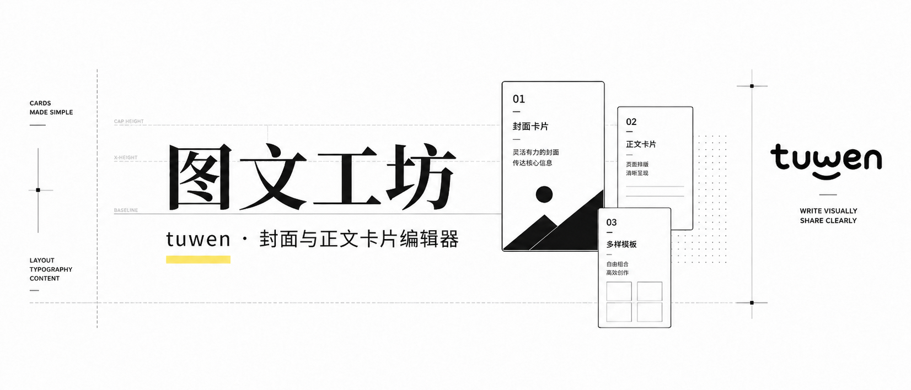

# 图文工坊 · tuwen



一个纯前端的图文封面与正文卡片编辑器。无需安装、无需后端，双击 `index.html` 即可在浏览器里使用。

左侧填写内容与调整样式，右侧实时预览，一键导出 PNG。所有内容自动保存在浏览器本地，刷新不丢。

## 在线体验

👉 [点击这里在线使用图文工坊](https://liliane0310.github.io/tuwen-craft/)

无需下载或安装，打开链接即可开始编辑并导出图片。

## 功能

### 封面编辑

多种风格模板，每个模板都提供文字、颜色、图片等可配置字段，所见即所得。

- 小红书效率风
- 瑞士平面排版风
- 手写涂鸦 Q&A 风
- 知识自媒体文章风
- Editorial Magazine 风
- 复古 Field Guide 风
- 线圈方格笔记风

支持在封面上添加标注（annotation），导出时一并渲染。

### 正文编辑（卡片模式）

把 Markdown 正文自动分页成多张 864×1152 的卡片，右侧按顺序预览，可批量导出为 PNG。

**支持的 Markdown 语法：**

- `# 标题` / `## 标题` / `### 标题`
- `**加粗**` / `*斜体*`
- `> 引用块`
- `- 列表`
- `---`（段落分隔留白）
- Markdown 表格

**局部文字样式（自定义标记）：**

- `{{color:#2563eb|文字}}` — 局部文字变色
- `{{bg:#fff3a3|文字}}` — 局部文字背景高亮

工具栏提供「加粗 / 斜体 / 引用 / 图片 / 文字色 / 高亮 / 查找替换 / 撤销重做」等按钮，文字色和高亮支持「画笔模式」——选好颜色后连续选中多段文字批量上色。

**插入图片：**

点工具栏「图片」按钮上传本地图片，自动以 `[[image:编号]]` 标记插入正文。上传时可弹出裁剪框，支持自由 / 原图 / 1:1 / 4:3 / 16:9 / 3:4 / 9:16 比例锁定，拖拽选区，应用裁剪。图片以 base64 存在本地，刷新不丢。

**每页独立背景图：**

预览区每张卡片右上角有「设背景」按钮（鼠标悬停显示），点击弹出背景设置浮层：

- 上传 / 换背景图（cover 铺满整张卡片）
- 透明度滑块（0–100%，保证文字可读）
- 调整裁剪（复用裁剪框）
- 应用到所有页（一键把当前页背景复制到全部卡片）
- 删除背景

背景配置绑页号，改正文导致分页变化时背景留在原页号位置。

**其他设置：**

字号、行距、文字色、背景色、中英文字体（苹方 / 宋体 / 楷体 / 黑体 / 霞鹜文楷 / 系统 Serif / Rounded / Mono / Lora 等）。

## 如何运行

### 方式一：直接打开（最简单）

双击 `index.html`，用浏览器打开即可。

### 方式二：本地起服务（推荐）

用 `file://` 打开时部分浏览器对字体、图片跨域有限制，建议起一个本地 HTTP 服务：

```bash
# Python
python -m http.server 8000

# 或 Node
npx serve .
```

浏览器访问 `http://localhost:8000`。

## 项目结构

```
.
├── index.html        # 主页面（封面编辑器 + 正文编辑器 UI 与样式）
├── body-editor.js     # 正文编辑器：Markdown 解析、分页排版、Canvas 渲染、图片/裁剪/背景图
├── embed.js           # 一次性脚本：把 kan64.txt 内嵌进瑞士风模板（构建用，非运行时）
├── fix_swiss.js       # 一次性脚本：修复瑞士风模板（构建用，非运行时）
├── fonts/             # 内嵌字体（沐尧随心手写体、下吴真楷）
├── assets/            # 模板预览图、Logo
├── kan64.txt          # 瑞士风模板用的素材 data URI
└── 封面参考*.jpg       # 测试用参考图
```

## 技术说明

- 纯原生 HTML / CSS / JavaScript，无构建步骤、无依赖。
- 封面导出使用 [html2canvas](https://cdnjs.com/libraries/html2canvas)（CDNR 引入）。
- 正文卡片用 Canvas 2D 直接绘制渲染，保证导出 PNG 与预览一致。
- 正文状态（含图片 base64、背景图配置）自动保存到 `localStorage`，键名 `tuwenBodyEditorState.v1`。配额不足时自动降级为仅保存文字、放弃图片缓存。

## 开发提示

- 正文编辑器的核心逻辑在 `body-editor.js` 的 IIFE 内：`parseInline` / `parseBlocks` 负责解析，`buildPages` 负责分页，`renderPage` / `drawPageToContext` 负责绘制。要加新的 block 类型或行内标记，从这几个函数入手。
- 图片裁剪相关的一组函数（`cropper`、`openCropper`、`drawCropper` 等）从 write-then-publish-main 项目移植简化而来。
- 修改瑞士风模板时，改完 `index.html` 里的 `TEMPLATES.swiss` 后需运行 `node embed.js` 把 `kan64.txt` 重新内嵌进去（该脚本会重写 `index.html`，运行前请备份）。
